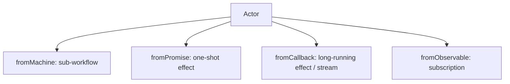
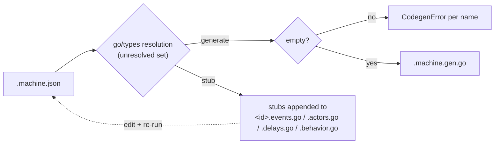
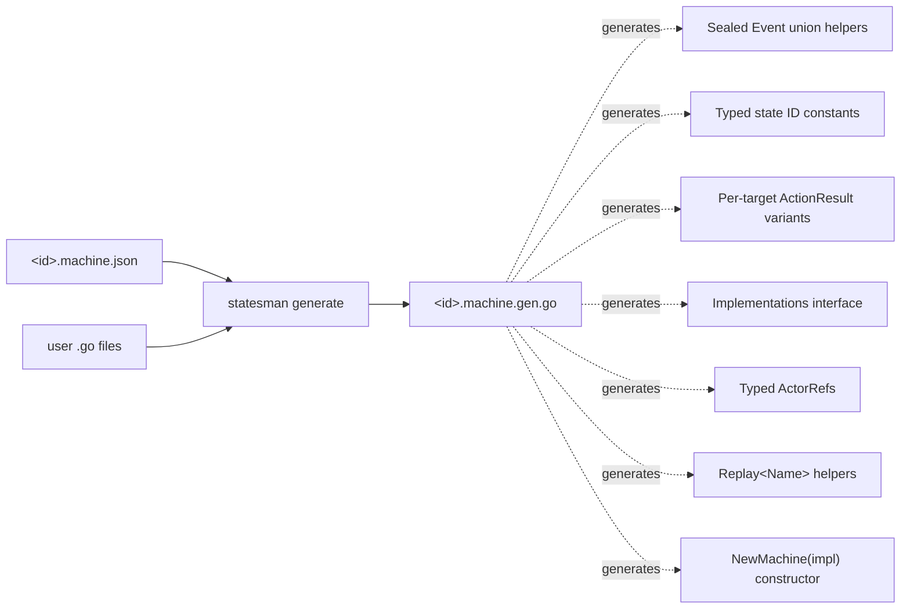
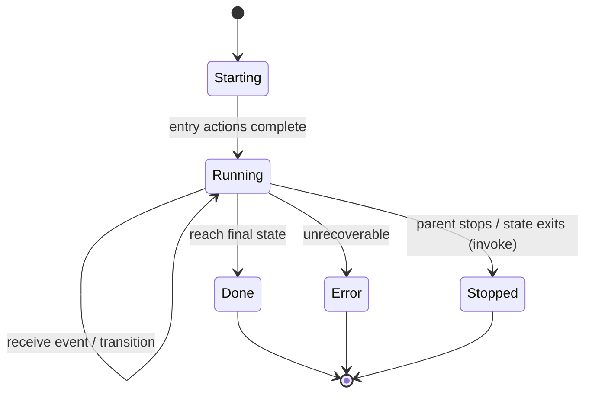
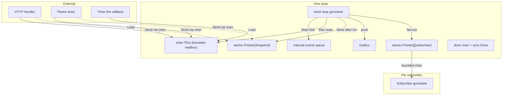
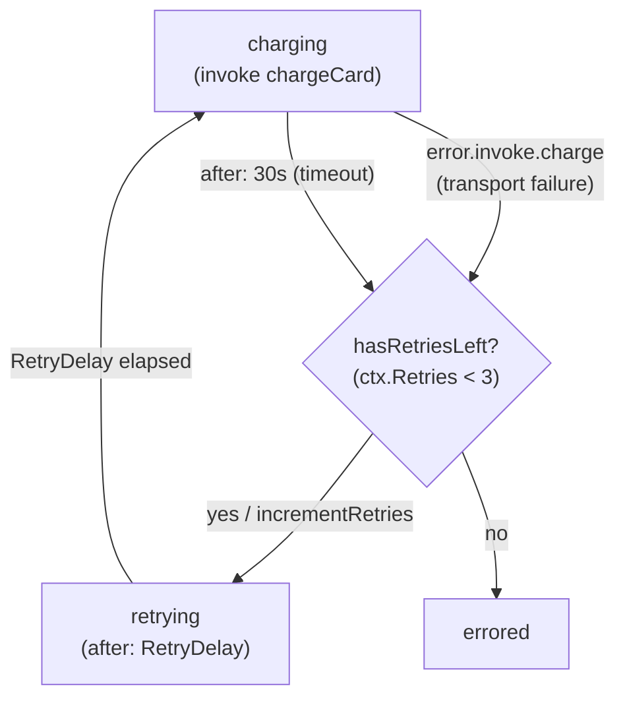
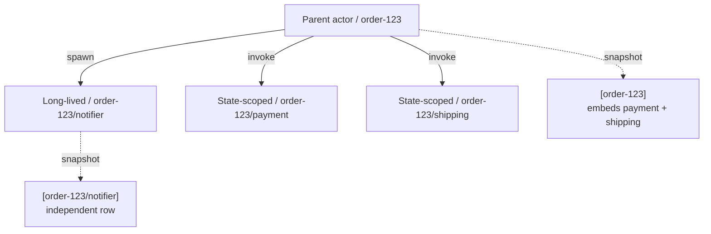

# statesman: Architecture

A Go statechart runtime, inspired by xstate and anchored on Stately's [`machineSchema.json`](https://github.com/statelyai/schema/blob/main/machineSchema.json), optimized for **long-running backend workflows**, built on Go generics.

> **Status:** v1, implemented. Implementation sequencing and roadmap live in [`TODO.md`](./TODO.md); this document stays focused on design and patterns.

---

## TL;DR

- **What it is:** a Go statechart runtime that consumes Stately-compatible `machine.json` and runs it as an actor tree with first-class persistence hooks.
- **What it's not:** a 1:1 port of xstate v5's TypeScript API. We keep the model, drop the TS-isms.
- **Authoring:** `machine.json` (Stately schema) + Go types in the package. **No JSON type-mapping file and no override sidecar** — codegen reads Go via `go/types` and resolves names by strict convention. A name that can't be resolved is a build error, fixed at the source. `statesman stub` emits compilable stubs for the Go you owe, so the cold start is fill-the-blanks, not author-blind.
- **Runtime:** everything is an actor; one goroutine per actor; pluggable `Clock` and `TimerService`; lock-free `Snapshot()` via atomic publication.
- **Durability:** core is persistence-*aware* via Snapshot/Restore + observer hooks; storage lives in a sibling `statesman/durable` package.

---

## Why

xstate's model — hierarchical/parallel states, actors, invoke/spawn, delayed transitions — is an excellent fit for backend workflows: payment sagas, multi-step provisioning, document pipelines, long-poll integrations. The current Go choice is between:

- Hand-rolled `switch` machines (no hierarchy, no composition, no introspection).
- Heavy workflow engines (Temporal, Cadence) that require a separate cluster.

There's room for a *library* that gives statechart semantics plus production-grade persistence, without a coordinator process and without sacrificing Go's type system.

## Non-goals

- **Not** a full SCXML-compliant engine. We implement the subset the Stately schema describes.
- **Not** a 1:1 TypeScript API port. No `setup()` builder; no template-literal event types; no conditional-type magic.
- **Not** a distributed workflow scheduler. Single-process by default. Distribution is a future layer above durable.
- **Not** trying to encode type information in JSON. Go types stay in Go.
- **Not** implementing the Stately Inspector protocol. Live introspection via logs + snapshots only.

---

## Type safety: the prime directive

The reason to use Go for this — instead of staying in TypeScript with xstate v5 — is type safety. Anything that ends up `any`, `interface{}`, or `map[string]any` at a user-facing API surface is a design failure. Five rules enforce this:

1. **Closed event unions.** Every event type is generated. The per-machine `Event` interface is sealed by an unexported marker method; only generated types can satisfy it.
2. **Narrowed events at action callsites.** Each transition that fires an action with a specific triggering event generates a method whose `evt` parameter is the *concrete* event type, not the union.
3. **Typed action params.** Per-action `<Name>Params` structs in user code become typed method parameters. No `map[string]any`.
4. **Typed actor refs and effects.** Every `invoke.src` and every spawn target resolves at codegen time to a concretely-parametrized `ActorRef[ChildCtx, ChildEvent]`. Cross-actor `SendTo` / `Spawn` use *per-target sealed `ActionResult` variants* — the wrong event to the wrong target is a compile error.
5. **Codegen-time failure for unresolved or ambiguous references.** If `machine.json` references something that doesn't resolve in the Go package (or normalizes to a colliding name), codegen fails clearly. Nothing falls through to runtime.

Where Go's type system lets us go *further* than xstate v5:

| | TypeScript xstate v5 | statesman |
|---|---|---|
| Event union sealing | Open (structural unions) | Sealed (nominal marker method) |
| Action effect | Returns whatever; runtime inspects | Returns sealed `ActionResult` sum |
| `SendTo` typing | TS-inferred | Per-target sealed variants; wrong-target = compile error |
| Persisted state restore | `any`-flavored | Generated `Restore<X>(snap, impl, …)` → typed `*Machine[Ctx, Evt]` |
| Activity result injection | Untyped | Typed `Replay<Name>(result)` per actor |
| State node IDs | Strings | Generated typed constants |

---

## Conceptual model

### Everything is an actor

In v5, machines, promises, callbacks, and observables are all actors. We adopt this fully. It collapses what would otherwise be two parallel concepts (effects vs. nested machines) into one.



A side-effecting HTTP call is just `fromPromise`. A nested workflow is just `fromMachine`. The parent observes the child's snapshot and reacts through normal transitions (`onDone`, `onError`).

All actions return variants of the sealed `ActionResult` sum type. The two families:

- **Pure effects** — `Assign{...}`, synchronous context updates.
- **Side effects** — `SendTo<Target>`, `Spawn<Target>`, `Noop`.

A transition may list multiple actions in `machine.json`; the runtime calls each action method in order, collects the results, applies assigns to accumulate a new context, and queues side effects to the outbox. This is how assign + sendTo compose within a single transition without returning a list.

### What an actor is at runtime

```
Actor
  ├─ Definition         (machine spec OR promise/callback adapter)
  ├─ Context            (TCtx, immutable; replaced on assign)
  ├─ ActiveStates       (set of typed state node IDs)
  ├─ Mailbox            (bounded chan TEvt)
  ├─ Internal queue     (self-sends, drained before mailbox)
  ├─ Children           (map[ID]Actor)
  ├─ Parent             (ActorRef, optional)
  ├─ Snapshot pointer   (atomic.Pointer[Snapshot[TCtx]])
  ├─ Subscriber list    (atomic.Pointer[[]subscriber], COW)
  ├─ Lifecycle status   (starting · running · done · error · stopped)
  └─ Address            (hierarchical path, e.g. /order-123/payment)
```

One actor = one goroutine + one bounded inbox channel. The actor tree is *the* runtime structure.

---

## Architecture overview

```
┌──────────────────────────────────────────────────────────┐
│  Generated per-machine code                              │
│  Sealed Event union · Action params · ActionResult sum   │
│  Implementations iface · Typed ActorRefs · NewXxx() ctor │
├──────────────────────────────────────────────────────────┤
│  statesman (core, no I/O)                                │
│  ─ Stately schema loader                                 │
│  ─ Deterministic transition algorithm                    │
│  ─ Actor runtime: goroutine + mailbox + supervision      │
│  ─ Lock-free snapshot via atomic publication             │
│  ─ Adapters: fromMachine, fromPromise, fromCallback, ... │
│  ─ Observer interfaces                                   │
│  ─ Ports: Clock, TimerService                            │
├──────────────────────────────────────────────────────────┤
│  statesman/durable (optional, reference impl)            │
│  SnapshotStore · EventLog · PersistentTimers · recovery  │
├──────────────────────────────────────────────────────────┤
│  Host application                                        │
│  Workflow registry · transport (HTTP / queue) · recovery │
└──────────────────────────────────────────────────────────┘
```

Each layer can be used without the one above. Tests use core only with in-memory `Clock`/`TimerService`.

---

## Authoring

### `machine.json` — Stately schema, verbatim

Structural only. Hierarchical states, parallel/history/final, `entry`/`exit`, `on`, `after`, `always`, `invoke` with `onDone`/`onError`. Actions and guards are `{type, params}` references. Round-trips with Stately Studio.

### User-authored Go (no JSON sidecar)

Pure Go in the same package:

```go
// types.go
package order

// User-authored "data" portion of the context. Codegen produces the
// final Context type by embedding this struct alongside typed child refs.
type ContextFields struct {
    UserID  string
    Amount  int64
    Retries int
}

// Sealed Event union. Embeds statesman.EventBase so the machine type
// (Machine[Context, Event]) satisfies the core TEvt constraint; the unexported
// orderEvent marker seals it so only types in this package can join.
type Event interface {
    statesman.EventBase
    orderEvent()
}

type Submit         struct{ Form FormData }
type Cancel         struct{}
type PaymentFailed  struct{ Err error }
type Retry          struct{}
func (Submit)        orderEvent() {}
func (Cancel)        orderEvent() {}
func (PaymentFailed) orderEvent() {}
func (Retry)         orderEvent() {}

// Callback emit subset: events WatchInventory may send back into the machine.
// User-authored and named in the adapter signature — codegen reads it from
// there. Members are also machine events.
type InventoryEvent interface {
    Event
    inventoryEvent()
}
type InventoryUpdated struct{ SKU string; Qty int }
type InventoryGone    struct{ SKU string }
func (InventoryUpdated) orderEvent()     {}
func (InventoryGone)    orderEvent()     {}
func (InventoryUpdated) inventoryEvent() {}
func (InventoryGone)    inventoryEvent() {}

// Callback receive subset: commands the machine may SendTo WatchInventory.
// Also user-authored and named in the adapter signature. They satisfy
// EventBase (so they're sendable) but are NOT members of the machine's union.
type InventoryCommand interface {
    statesman.EventBase
    inventoryCommand()
}
type WatchSKUs struct{ SKUs []string }
type StopWatch struct{}
func (WatchSKUs) inventoryCommand() {}
func (StopWatch) inventoryCommand() {}

// Action params: a struct per action that takes params. Its presence under the
// <Name>Params convention is what tells codegen the action is parameterized.
type LogErrorParams struct{ Level LogLevel }

// Guard params: same convention.
type AmountAboveParams struct{ Threshold int64 }
```

```go
// actors.go
package order

// Adapter kind detected from function signature.
// Promise: (ctx, input) → (output, error)
func ChargeCard(ctx context.Context, in ChargeInput) (ChargeResult, error) { /*...*/ }

// Callback: (ctx, emit, receive) → error. The emit subset (InventoryEvent) and
// receive subset (InventoryCommand) are the user-authored parameter interfaces;
// codegen reads them straight from this signature.
func WatchInventory(ctx context.Context, emit func(InventoryEvent), receive <-chan InventoryCommand) error { /*...*/ }

// Machine: () → MachineDef[Ctx, Evt]
func PaymentMachineDef() statesman.MachineDef[payment.Context, payment.Event] { /*...*/ }
```

```go
// delays.go
package order

import "time"

const RetryDelay = 5 * time.Second
```

### Scaffolding: `statesman stub`

Authoring the Go side (Stage 2) is **not** a guess-then-get-yelled-at loop. `statesman stub` is the cold-start half of the validator: it and `statesman generate` run the *same* `go/types` name-resolution pass against `machine.json` + your existing `.go`, and differ only in what they do with the **unresolved set** — names the schema references that have no Go symbol yet.

- **`statesman stub`** — appends a compilable stub for every member of the unresolved set to its conventional file (`<id>.events.go` / `<id>.actors.go` / `<id>.delays.go`, and `<id>.behavior.go` for the `Impl` skeleton), creating the file if absent; non-destructive, re-run anytime.
- **`statesman generate`** — emits/re-emits `<id>.machine.gen.go` for every machine in scope; errors on the unresolved set (`CodegenError`, see [Error model](#error-model)) and warns on any surviving `statesman.Unspecified`.
- **`statesman init <name>`** — bootstraps a fresh machine package: a runnable `idle → done` starter `<id>.machine.json` + a `//go:generate go tool statesman generate` directive, then runs `stub` and `generate` so `go test ./...` is green on first run.



`statesman stub` against a fresh `machine.json` appends, by category, into the files you already author — no separate file to rename:

```go
// stub appends each missing symbol to its conventional file: creating it if
// absent, appending if present — never a rewrite of what you wrote. gofmt and
// import management run afterward.

// order.events.go — events, the sealed union, param structs, context fields
type Event interface {
    statesman.EventBase
    orderEvent()
}
type Submit        struct{ /* TODO: fields */ }
type Cancel        struct{}
type PaymentFailed struct{ /* TODO: fields */ }
func (Submit)        orderEvent() {}
func (Cancel)        orderEvent() {}
func (PaymentFailed) orderEvent() {}
type LogErrorParams struct{ Level statesman.Unspecified /* TODO: type */ } // param names known, types not

// order.actors.go — adapter kind is NOT in the schema; stub emits the promise shape.
// Switch to callback/observable/machine by editing the signature.
func ChargeCard(ctx context.Context, in statesman.Unspecified) (statesman.Unspecified, error) {
    panic("TODO: implement ChargeCard")
}

// order.delays.go
const RetryDelay = 0 // TODO: set duration

// order.behavior.go — Impl skeleton: one panicking method per action/guard/input
type Impl struct{}
func (Impl) ValidateFormOnSubmit(ctx Context, evt Submit) ActionResult {
    panic("TODO: implement ValidateFormOnSubmit")
}
```

Three honest limits, each marked in the emitted code:

1. **Adapter kind is unknowable from the schema.** Stately's `invoke.src` is only a name — no promise/callback/machine signal. `statesman stub` emits the **promise** shape (the common backend case) and documents the switch; the kind is still ultimately resolved from the signature you keep ([actors.go convention](#user-authored-go-no-json-sidecar)).
2. **Field and param types are unknowable.** The schema gives *names* (`level`), not Go types. `statesman stub` infers from JSON literal values where the schema has an initial `context`/`params` value (string → `string`, number → `int64`, bool → `bool`); everywhere else it emits `statesman.Unspecified` (a `= any` alias) + a `TODO`. `Unspecified` is greppable, and `statesman generate` emits a **warning** listing any that survive into a build — so `any` never silently reaches a delivered surface.
3. **Bodies are `panic("TODO")`.** Stubs compile (so codegen can read their signatures) but fail loudly if reached before you implement them — consistent with the [panic policy](#subtle-issues-documented): an unfilled stub *is* a programming error.

**The behavior skeleton.** `statesman stub` emits an `Impl` skeleton to `<id>.behavior.go` — a struct with one method per action/guard/invoke-input callsite stubbed to `panic("TODO")`, signatures already carrying the concrete event and param types ([per-callsite narrowing](#generated-code-the-users-surface)) from the very computation that builds the `Implementations` interface. This turns the compiler's "N missing methods" into N ready-to-fill bodies. It is strictly additive — it emits only methods a present `Impl` lacks, so it converges across re-runs and never fights a real implementation.

**Non-destructive and idempotent.** `statesman stub` never overwrites a hand-written symbol — it appends only the still-unresolved set to the conventional files, then runs gofmt/goimports — so it doubles as a day-2 tool: add an event in Studio, re-run `statesman stub`, get just the new stub in `<id>.events.go`. This preserves [decision 9](#decisions-snapshot): the JSON + convention remain the only source of truth; it writes user-owned Go and changes nothing about how names resolve.

### Naming normalization

Codegen normalizes JSON identifiers to Go-PascalCase by splitting on word boundaries (underscores, hyphens, case transitions) and joining capitalized:

| JSON name | Normalized Go name |
|---|---|
| `SUBMIT` | `Submit` |
| `PAYMENT_FAILED` | `PaymentFailed` |
| `validateForm` | `ValidateForm` |
| `payment-charge-card` | `PaymentChargeCard` |
| `done.invoke.charge` | `ChargeDone` (special-cased; matches `invoke.id`) |
| `error.invoke.charge` | `ChargeError` |

**Codegen fails (does not silently fix) on:**

- Names starting with a digit (`2fa_required` → not a valid Go ident).
- Names that normalize to a Go reserved word (`type`, `func`, `range`).
- Two distinct JSON names that normalize to the same Go ident.
- A name referenced in `machine.json` with no matching Go symbol.

There is no override file. A name that can't be resolved by convention is a build error you fix at the source — rename the JSON identifier in Stately Studio (the schema round-trips) or add the missing Go symbol. Keeping JSON identifiers Go-compatible, and naming Go symbols by convention, is part of the authoring contract.

### Codegen pipeline



### Multiple machines

The unit is the **Go package**: one machine per package. The package-scoped generated singletons — `Event`, `Context`, `States`, `ActionResult`, `Implementations` — would name-collide if two machines shared a package, so the convention forces the split; multiple machines means multiple packages. Identity lives in the **filename**, not the directory: each package holds a single `<id>.machine.json` whose `id` the filename prefix must equal, and the generated facade is `<id>.machine.gen.go`. The per-machine constructor `New<Machine>Machine` takes its prefix from the `id`; the singletons stay unprefixed because the package already scopes them. The package may sit in any directory the app developer chooses — `id == directory name` is the convenient default `statesman init` scaffolds, not a requirement.

Composition is plain Go imports. A parent that `invoke`s a child via `fromMachine` references the child's `MachineDef` constructor:

```go
// order/order.actors.go — order invokes the payment machine
func PaymentMachineDef() statesman.MachineDef[payment.Context, payment.Event] { /*...*/ }
```

`statesman generate` reads `payment.Context` / `payment.Event` across the import boundary and types the parent's child ref as `ActorRef[payment.Context, payment.Event]`. Sending the wrong event to the wrong child machine is a compile error across packages, exactly as within one.

Two properties fall out of using imports as the composition mechanism:

- **Generation is import-topological.** A parent needs the child's *generated* `Context`, so `statesman generate ./...` loads each package's source in isolation — a parent's still-ungenerated child refs don't block it — and orders emission by the import graph, leaves first, parents last, settling the whole tree in one run.
- **Composition is acyclic, for free.** Go forbids import cycles, so `A → B → A` composition is unrepresentable via `fromMachine`. Recursion is modeled inside one machine's hierarchy or via address-based `spawn`, not by mutually-invoking packages.

Sibling root machines are simply separate packages the host registers side by side; nesting is the invoke/spawn addressing already described ([Actor addressing](#actor-addressing)).

### Generated code: the user's surface

For a machine that invokes `watchInventory` at the root (a `fromCallback` streaming stock changes, sendable via its `receive`-subset parameter) and, in `processing`, `invoke`s the `chargeCard` promise — where `idle.on.SUBMIT → processing` fires `validateForm` (which forwards the order's SKUs to the inventory watcher) and payment failure runs `incrementRetries`:

```go
// order.machine.gen.go (generated; do not edit)
package order

// --- Typed state IDs ------------------------------------------------
var States = struct {
    Idle       StateID
    Processing struct{ Charging StateID; Confirming StateID }
    Errored    StateID
    Done       StateID
}{
    Idle:    "idle",
    Errored: "errored",
    Done:    "done",
    Processing: struct{ Charging StateID; Confirming StateID }{
        Charging:   "processing.charging",
        Confirming: "processing.confirming",
    },
}

// --- Sealed event union --------------------------------------------
// EventType() satisfies the core EventBase constraint.
func (Submit)        EventType() string { return "SUBMIT" }
func (Cancel)        EventType() string { return "CANCEL" }
func (PaymentFailed) EventType() string { return "PAYMENT_FAILED" }
func (Retry)         EventType() string { return "RETRY" }

// Generated for invoke.src="chargeCard" — payload type from its signature.
type ChargeDone  struct{ Output ChargeResult }
type ChargeError struct{ Err    error }
func (ChargeDone)  orderEvent()    {}
func (ChargeError) orderEvent()    {}
func (ChargeDone)  EventType() string { return "done.invoke.charge" }
func (ChargeError) EventType() string { return "error.invoke.charge" }

// --- Sealed ActionResult sum, closed over THIS machine's children ---
type ActionResult interface{ isActionResult() }

type Assign          struct{ Fields  ContextFields }    // pure; runtime preserves child refs
type SendToInventory struct{ Command InventoryCommand } // send to the watchInventory callback
type Noop            struct{}
// A machine that dynamically spawns an actor also gets a Spawn<Target> variant
// here (mirroring SendTo<Target>); this machine spawns none.

func (Assign)          isActionResult() {}
func (SendToInventory) isActionResult() {}
func (Noop)            isActionResult() {}

// --- Implementations interface (per-callsite narrowed methods) ------
//
// Per-callsite methods receive the concrete event type — no type assertions.
// For high-fanout actions (wired on many transitions), codegen also generates
// a union-typed fallback method. The user implements either:
//   - per-callsite methods for transitions where the event type matters, or
//   - the fallback method to handle all callsites with one implementation, or
//   - both: per-callsite overrides take precedence; fallback covers the rest.
type Implementations interface {
    // shape=context_event — wired in: idle.on.SUBMIT
    ValidateFormOnSubmit(ctx Context, evt Submit) ActionResult

    // shape=context — wired in: processing.charging.on.PAYMENT_FAILED
    IncrementRetriesOnPaymentFailed(ctx Context) ActionResult

    // shape=context_event_params — wired in: errored.on.RETRY
    // Per-callsite override takes precedence over the fallback below.
    LogErrorOnRetry(ctx Context, evt Retry, params LogErrorParams) ActionResult

    // Union-typed fallback — handles all LogError callsites that lack a
    // per-callsite override. Codegen generates this when the action appears
    // on 2+ transitions. The user can type-switch on evt if needed.
    LogError(ctx Context, evt Event, params LogErrorParams) ActionResult

    // Guards — also per-callsite, typed.
    HasRetriesLeftOnPaymentFailed(ctx Context) bool
}

// --- Context: codegen-owned, embeds user's ContextFields ------------
// User declares ContextFields with their data; codegen produces Context
// embedding the user fields plus typed child refs. User code accesses
// ctx.UserID (promoted) and ctx.Charge (typed ref) the same way.
type Context struct {
    ContextFields                                                // user-authored
    Inventory statesman.ActorRef[struct{}, InventoryCommand]    // invoke watchInventory (callback: sendable + emits)
    Charge    statesman.ActorRef[ChargeResult, statesman.Never] // invoke.src="chargeCard" (promise: observe/await/Close, not sendable)
}

// --- Callback subset EventType() helpers ----------------------------
// The subset interfaces (InventoryEvent, InventoryCommand) and their markers
// are user-authored in types.go; codegen reads them from the WatchInventory
// signature. Codegen supplies only the EventType() the EventBase constraint
// needs for the receive-subset commands:
func (WatchSKUs) EventType() string { return "WATCH_SKUS" }
func (StopWatch) EventType() string { return "STOP_WATCH" }

// --- Replay helpers for activity-result injection -------------------
// Each declared actor with output produces one typed Replay helper.
func ReplayCharge(addr ActorAddress, result ChargeResult) statesman.ReplayedResult
func ReplayCharge_Error(addr ActorAddress, err error)    statesman.ReplayedResult

// --- Constructor & Restore -----------------------------------------
// Both return an UNSTARTED *Machine. Caller configures observers and
// then calls Start(ctx). Single-shot Start applies to both paths.
func NewOrderMachine(impl Implementations) *statesman.Machine[Context, Event]

func RestoreOrder(
    snap     statesman.Snapshot[Context],
    impl     Implementations,
    replayed ...statesman.ReplayedResult,  // typed via the Replay helpers above
) (*statesman.Machine[Context, Event], error)
```

The user writes:

```go
type OrderImpl struct{ /* deps */ }

func (o OrderImpl) ValidateFormOnSubmit(ctx Context, evt Submit) ActionResult {
    if !evt.Form.Valid() {
        return Noop{}
    }
    // Tell the inventory watcher which SKUs to track. Wrong command type, or
    // sending to the wrong target, → compile error (per-target sealed variant).
    return SendToInventory{Command: WatchSKUs{SKUs: evt.Form.SKUs()}}
}

func (o OrderImpl) IncrementRetriesOnPaymentFailed(ctx Context) ActionResult {
    return Assign{Fields: ContextFields{
        UserID: ctx.UserID, Amount: ctx.Amount, Retries: ctx.Retries + 1,
    }}
}

func (o OrderImpl) LogErrorOnRetry(ctx Context, evt Retry, params LogErrorParams) ActionResult {
    o.log(params.Level, "retrying")
    return Noop{}
}

func (o OrderImpl) HasRetriesLeftOnPaymentFailed(ctx Context) bool {
    return ctx.Retries < 3
}

// Typed child access falls out of the embedded Context:
func (o OrderImpl) IsChargeRunningOnSubmit(ctx Context, evt Submit) bool {
    if ctx.Charge == nil { return false }
    return ctx.Charge.Snapshot().Status == statesman.StatusRunning
}
```

And starting / resuming:

```go
// Fresh workflow:
m := order.NewOrderMachine(impl)
m.AddObserver(durable)               // configure before Start
err := m.Start(ctx, "order-123")

// Resume from a persisted snapshot, injecting a known activity result:
m, err := order.RestoreOrder(snap, impl,
    order.ReplayCharge(snap.Children[0].Address, ChargeResult{ID: "ch_123"}),
)
if err != nil { return err }
m.AddObserver(durable)
err = m.Start(ctx)                   // address comes from the snapshot
```

**What this buys:**

- Forgetting to wire an action → compile error (missing interface method).
- Wrong event payload type → compile error.
- Wrong `SendToInventory` command type, or sending to the wrong target → compile error.
- Misspelled state ID → compile error (no such field on `States`).
- New event added in `machine.json` without a matching Go type → codegen error.
- Activity replayed with wrong result type → compile error.

**Trade-off:** if the same action is wired in N transitions with N triggering events, per-callsite narrowing produces N methods. For most actions (1–3 transitions), this is negligible. For high-fanout actions, codegen generates a union-typed fallback method: implement one method for the common case, override specific callsites where the concrete event type matters. Delegate shared logic to a private helper either way.

---

## Core interfaces

Standard-library-flavored, composable, single-purpose.

### Actor capabilities (composed à la `io`)

```go
type Sender[T any]      interface { Send(ctx context.Context, evt T) error }
type Snapshotter[T any] interface { Snapshot() Snapshot[T] }
type Subscriber[T any]  interface {
    Subscribe(ctx context.Context, fn func(T), opts ...SubscribeOption)
}
type Addressable        interface { Address() ActorAddress }

// ActorRef composes these. io.Closer reused for lifecycle.
type ActorRef[TCtx any, TEvt EventBase] interface {
    Sender[TEvt]
    Snapshotter[TCtx]
    Subscriber[Snapshot[TCtx]]
    Addressable
    io.Closer
}
```

Mirrors `io.ReadWriteCloser`. A test mock can satisfy `Sender[OrderEvent]` alone; a debug printer accepts `Snapshotter[Context]`.

### Actor ref shapes by adapter kind

`ActorRef[TCtx, TEvt]` is uniform, but each adapter parametrizes it differently — and not every actor is sendable. `statesman.Never` is an uninhabited event type (no constructible values), so `Send` on a ref typed `[…, Never]` cannot be called:

```go
type Never interface { EventBase; isNever() }  // no implementers; uninhabited
```

| Adapter | Ref type | `TCtx` (snapshot context) | `TEvt` (sendable) |
|---|---|---|---|
| `fromMachine` | `ActorRef[Ctx, Evt]` | child's `Context` | child's sealed `Event` |
| `fromPromise` | `ActorRef[Out, Never]` | result (zero value until done) | none — observe, await `done.invoke.<id>`, or `Close()` |
| `fromCallback` | `ActorRef[struct{}, Cmd]` | none | receive subset named in the adapter signature; `Cmd` satisfies `EventBase` |
| `fromObservable` | `ActorRef[Out, Never]` | latest emitted value | none |

A promise is one-shot — you cannot `SendTo` it. A callback is the only non-machine actor you can `SendTo`, and only with the command subset its signature declares (the `receive` parameter type). This is why, in the example above, `Charge` is `[…, Never]` while `Inventory` is `[…, InventoryCommand]`.

### `ActorSpec` — the central polymorphism

```go
type ActorSpec interface {
    spawn(parent actorContext) (runningActor, error)  // unexported
}
```

Users construct specs via typed constructors, never implement the interface directly:

```go
statesman.PromiseActor(ChargeCard)         // returns ActorSpec
statesman.MachineActor(PaymentMachineDef())  // returns ActorSpec
statesman.CallbackActor(WatchInventory)    // returns ActorSpec
statesman.ObservableActor(NewsFeed)        // returns ActorSpec
```

Pattern matches `http.Handler` + `http.HandlerFunc` + `http.FileServer`.

### Persistence ports (`json.Marshaler`-shaped)

```go
type SnapshotMarshaler   interface { MarshalSnapshot() ([]byte, error) }
type SnapshotUnmarshaler interface { UnmarshalSnapshot([]byte) error }

// In statesman/durable (type-erased at the storage boundary):
type SnapshotStore interface {
    Load(ctx context.Context, addr ActorAddress) ([]byte, bool, error)
    Save(ctx context.Context, addr ActorAddress, data []byte, version int) error
    Delete(ctx context.Context, addr ActorAddress) error
}

type EventLog interface {
    Append(ctx context.Context, addr ActorAddress, evt EventRecord) error
    Read(ctx context.Context, addr ActorAddress, fromSeq int64) ([]EventRecord, error)
}
```

### Observers — small, single-method-ish

```go
type TransitionObserver[TCtx any, TEvt EventBase] interface {
    OnTransition(ctx context.Context, before, after Snapshot[TCtx], evt TEvt) error
}

type ActorObserver interface {
    OnActorStart(addr ActorAddress)
    OnActorStop(addr ActorAddress, reason error)
}

type TimerObserver interface {
    OnTimerScheduled(t ScheduledTimer)
    OnTimerFired(t ScheduledTimer)
}
```

Host implements only what it needs; runtime type-asserts at registration. Composition via small interfaces, not one god hook type.

### `Clock` + `TimerService`

Defined in the [Time and timers](#time-and-timers) section. Core interfaces; pluggable for testing (`ManualClock`) and production (`PersistentTimerService`).

---

## Generics in the core runtime

The per-machine generated code sits on a small generic core:

```go
type EventBase interface{ EventType() string }

type Machine[TCtx any, TEvt EventBase] struct { /* unexported */ }

func (m *Machine[TCtx, TEvt]) Start(ctx context.Context, address string) error
func (m *Machine[TCtx, TEvt]) Send(ctx context.Context, evt TEvt) error
func (m *Machine[TCtx, TEvt]) Snapshot() Snapshot[TCtx]
func (m *Machine[TCtx, TEvt]) Subscribe(ctx context.Context, fn func(Snapshot[TCtx]), opts ...SubscribeOption)
func (m *Machine[TCtx, TEvt]) Close() error
func (m *Machine[TCtx, TEvt]) Address() ActorAddress
func (m *Machine[TCtx, TEvt]) AddObserver(o any) // type-asserts to the observer interfaces; the one intentional `any` at the registration boundary

type Snapshot[TCtx any] struct {
    MachineID      string
    Address        ActorAddress
    ActiveStates   []StateID              // typed; not raw strings
    Context        TCtx                   // typed, not json.RawMessage
    PendingAfter   []ScheduledTimer
    Children       []ChildRef
    Status         ActorStatus
    ErrorReason    error                  // non-nil iff Status == Error
    Version        int                    // monotonic per actor, incremented on each completed transition
    InvokeRestarts map[string]int         // per-invoke re-spawns beyond the first (retry-storm signal); nil when none
}
```

- `EventBase` is the *only* core-level constraint; each machine's *sealed* `Event` interface is a strict subset.
- `Snapshot[TCtx]` round-trips serialization with types intact: serialization happens at the storage boundary, types are known at the `Restore` callsite.
- `Version` is monotonic per actor, incremented by 1 on each completed transition. The durable layer can use it for optimistic concurrency (compare-and-swap on `Save`).
- **Core / codegen boundary.** The core's transition algorithm is generic over `TCtx` and `TEvt` but never inspects `ActionResult` variants. The generated constructor (`NewOrderMachine`) closes over the concrete types and injects an opaque applier into the core. The core sees only `func(actionIndex int, ctx TCtx, evt TEvt) appliedEffect` — a closure that captures the per-machine `ActionResult` sum, the `Implementations` receiver, and the callsite-to-method dispatch table. This keeps the core free of per-machine specialization while preserving the sealed sum's compile-time safety in user code. The core never names `ActionResult`; it never `interface{}`-erases it; the closure is the type boundary.

---

## Runtime model

### Actor lifecycle



`Done` and `Error` emit terminal events the parent observes (`onDone` / `onError`). Once an actor reaches a terminal status, it does not restart — construct a new actor instead.

### Transition step (deterministic)

Each event is processed end-to-end, in this order:

1. Receive event (internal queue first, then mailbox).
2. Evaluate guards on candidate transitions in document order.
3. Compute exit set, entry set, and the transition's actions.
4. **Snapshot the pre-transition state** (context + active states). This is the rollback point.
5. Run **exit actions** (assigns accumulate a new context; spawned-by-this-state actors stopped).
6. Run **transition actions**.
7. Run **entry actions** (assigns accumulate context; `invoke` spawns new children).
8. Run **sync observers**. Two branches:
   - **Happy path** (all observers return nil): continue to step 9.
   - **Abort path** (any observer returns error): **full rollback.** Discard the pending context and active-state changes. Build a failure snapshot from the *pre-transition* state (step 4) with `Status = Error` and `ErrorReason` set from the observer error. `atomic.Store(failure snapshot)`. Emit the child's error event to the parent — `error.invoke.<id>` for an invoke child, `error.actor.<address>` for a spawned child (see [Supervision](#supervision)); a root machine with no parent surfaces the failure via its snapshot and observers only. Notify subscribers. Exit the actor loop — the actor is now terminal.
9. **Publish** the new snapshot via `atomic.Pointer.Store`.
10. **Drain the outbox** — fire `SendTo<X>`, complete `Spawn<X>`.
11. Notify subscribers.
12. Process `always` (eventless) transitions. **Loop guard:** if `always` transitions fire more than 100 consecutive iterations (configurable via `WithAlwaysLimit`), the actor transitions to `Error` with `ErrAlwaysLoopExceeded`. This prevents infinite loops from misconfigured eventless transitions.

This sequence is the contract. Persistence layers wrap the step boundary at step 8.

**Context immutability convention.** Go does not enforce value immutability. The runtime treats Context as immutable — assigns produce a new value, and the pre-transition snapshot (step 4) is the rollback copy. User code must treat the `ctx` parameter in action/guard methods as read-only. Mutating it in place (e.g. `ctx.Retries++`) corrupts the published snapshot and breaks rollback. This is a convention, not a compile-time guarantee.

---

## Concurrency model

### Goroutine architecture



| What | Where it runs | Who writes |
|---|---|---|
| Mailbox `chan` | — | Multiple senders, one receiver |
| Actor loop | Actor's own goroutine | Only goroutine that mutates context, ActiveStates, Children |
| `atomic.Pointer[Snapshot]` | — | Actor goroutine `Store`s; everyone else `Load`s |
| Subscriber list | — | Subscribe / unsubscribe via copy-on-write |
| Sync observer | Actor's goroutine | Blocks transition until returns |
| Subscriber callback | Subscriber's own goroutine | Drain rate is the subscriber's responsibility |
| Timer fire | Fresh goroutine from `time.AfterFunc` or scheduler pool | Issues a `Send` |

### Mailbox semantics

- **Bounded**, default capacity 256, configurable per actor.
- **Blocking `Send` with `context.Context`** — natural Go channel semantics; caller controls timeout via ctx.
- **Send-after-Close returns `ErrActorStopped`**, never panics:

```go
func (a *runningActor[...]) Send(ctx context.Context, evt TEvt) error {
    select {
    case <-a.done:        return ErrActorStopped
    case <-ctx.Done():    return ctx.Err()
    case a.inbox <- evt:  return nil
    }
}
```

- **Internal events queue** (self-sends from action effects) is drained before the mailbox each iteration. Required for SCXML semantics and prevents self-deadlock on a full mailbox.

### Snapshot publication — lock-free reads

The actor goroutine builds the next snapshot fully, then publishes via `atomic.Pointer.Store`. Readers do `Load` and read freely. Mid-transition readers see the pre-state or the post-state, never an intermediate. This works for free because our action model is already immutable (assigns produce a new `ContextFields` value; the runtime constructs the full `Context`).

```go
func (a *runningActor[TCtx,TEvt]) Snapshot() Snapshot[TCtx] {
    return *a.snap.Load()
}
```

### Subscribers — strong delivery by default

Subscribers receive a **bounded queue with blocking on overflow**. A slow subscriber **stalls the actor**. This is a deliberate choice for backend-workflow audit semantics:

- Every transition is delivered to every registered subscriber, eventually.
- The contract: subscribers must drain fast.

**Operational implications:**

- Registering a subscriber is a load-bearing operation. The "harmless debug listener" anti-pattern can stall production workflows.
- A `StallObserver` should be wired in production to surface "subscriber X has held the transition for >Nms" via metrics.
- For genuinely lossy use cases (UI feeds, drop-OK metrics), use the helper:
  ```go
  statesman.WithLatestWins(ctx, ref, func(s Snapshot[Ctx]) { /*...*/ })
  ```
  which spins a small internal latest-wins channel and a fast-draining proxy subscriber.
- Per-call buffer sizing: `ref.Subscribe(ctx, fn, statesman.WithBuffer(64))`.

### Observer ordering (decision 27)

```
event accepted
  → snapshot pre-transition state (rollback point)
  → run actions (collect outbox)
  → run sync observers       ◀── durable layer writes snapshot here
  → atomic.Store new snapshot ◀── publication point
  → drain outbox             ◀── effects fire after persistence
  → notify subscribers       ◀── observation after effects
```

Effects fire **after** the snapshot is persisted. If a crash happens between persistence and outbox drain, the effects re-fire on recovery. The durable layer's `Runtime` wrapper handles this: on startup, it compares the persisted snapshot's outbox (stored alongside the snapshot) against the event log to identify effects that were persisted but not yet drained, and re-executes them. Activities must be idempotent or use `Replay<Name>` injection to skip re-execution.

A **sync observer returning error aborts the transition** with full rollback (see [Transition step](#transition-step-deterministic)): the actor reverts to its pre-transition state, sets `Status = Error`, and the parent receives `onError`. Conservative; appropriate for backend workflows where partial commits are worse than visible failure.

### Lifecycle

- **`Start` is single-shot.** `sync.Once` enforces. Second call returns `ErrAlreadyStarted`. Both `NewXxx(impl).Start(ctx, addr)` and `RestoreXxx(snap, impl).Start(ctx)` flip the same `sync.Once`. Re-running means constructing a fresh `Machine`.
- **Close is idempotent.** `sync.Once` + `done chan struct{}`. Safe to `defer ref.Close()`.
- **Parent ctx → child ctx via `context.WithCancel`.** Parent shutdown cascades to children automatically.
- **Bottom-up shutdown.** When stopping, the parent stops each child, waits for each to drain, then closes itself. Otherwise: child's final event lands in a closed parent mailbox.
- **Graceful shutdown.** `Close()` initiates bottom-up shutdown. The actor drains its internal queue (self-sends from the current transition) but **drops pending mailbox events**. In-flight transitions complete; no new events are accepted. For graceful drain of the mailbox, use `CloseAfterDrain(ctx)` which processes remaining mailbox events before closing (bounded by ctx deadline).
- **Timer cancellation surfaces the race.** `Timer.Cancel()` returns `bool` (mirrors `time.Timer.Stop()`); `false` means the timer already fired and its event is in flight. Callers handle the event-already-enqueued case explicitly.

### Subtle issues, documented

- **Observer-induced deadlock.** A sync observer that calls `actor.Send` synchronously deadlocks. Document: observers must not call `Send` on the actor they observe; use the outbox via `ActionResult`. Detection: enable goroutine-id assertions in `-race` / `-debug` builds.
- **Concurrent Subscribe/Unsubscribe during transition.** Subscriber list uses `atomic.Pointer[[]subscriber]` with copy-on-write. Transitions read the snapshot once per delivery; mutations swap the pointer.
- **Bottom-up shutdown** is not optional. Closing the parent first creates a window where the child's final-event `Send` lands in a closed mailbox.
- **`-race`-clean as CI gate.** The whole runtime + tests must pass `go test -race`. Non-negotiable.
- **Panics in user code.** Action and guard methods must not panic. A panic in user code crashes the actor's goroutine, leaves its mailbox filling, and may deadlock the parent. This is intentional: panics are programming errors, not recoverable conditions. Document this in the generated code's godoc. If the host needs crash isolation, it should run actors in separate processes — that's a distribution concern, not a core concern.

---

## Time and timers

Two interfaces, both pluggable:

```go
type Clock interface { Now() time.Time }

type TimerService interface {
    Schedule(ctx context.Context, at time.Time, fire func()) Timer
}

type Timer interface {
    Cancel() bool
    Deadline() time.Time
}
```

- **In-process default:** `WallClock` + `InProcessTimerService` (`time.AfterFunc`). Timers do not survive a crash; on `Restore`, the runtime re-registers any `PendingAfter` entries from the snapshot.
- **Production:** swap in a DB-backed `TimerService` (Postgres `LISTEN/NOTIFY`, Redis ZSET, etc.). `statesman/durable` ships a reference impl.
- **Tests:** `ManualClock` + `ManualTimerService` for deterministic virtual time.
- **Cancellation is state-scoped.** Each `after` timer is scheduled with its *state's* `context.WithCancel` ctx, so leaving the state — directly or when a parent compound state exits — cancels the pending fire through the actor ctx tree, with no per-timer bookkeeping. `Timer.Cancel()` stays for explicit one-off cancels; `PendingAfter` stays the durable record. The split: ctx scopes the in-memory lifecycle, `Clock` sources the timing, the snapshot owns durability — `context.WithTimeout` is never the timer of record (it bypasses the pluggable `Clock` and dies on crash).

---

## Cancellation, timeouts, and retries

Three faces of one thing — control flow over time — and none is a library feature; each composes existing primitives (the context tree, `after`, guards, `assign`). The rule from [Time and timers](#time-and-timers) holds throughout: **context delivers cancellation, the pluggable `Clock` times it, the snapshot persists it.**

### Cancellation

The actor tree is a context tree (parent ctx → child ctx via `WithCancel`). Exiting a state stops its invoke children and cancels their ctx, so `ctx.Done()` fires inside the adapter and the in-flight call aborts. Context is the *delivery*; the chart is the *decision* — the adapter just aborts, and *why* it was canceled (timeout, business cancel, plain exit) is recorded by the chart, not read from a ctx cause. Two sources:

- **Business cancel is a `CANCEL` event** — a recorded transition that runs exit/compensation actions and lands in the snapshot. Never express a business cancel as a raw ctx cancel — that skips the recorded transition and its compensation.
- **Lifecycle teardown** (`Close()`, root ctx canceled) cascades down the ctx tree.

### Timeouts

A timeout is a **plain `after` transition** on the invoking state — standard Stately/xstate semantics, fully visible in the chart. `after: { 30000: <target> }` on `charging`: when it fires it exits the state, which stops the activity (the in-flight call aborts on `ctx.Done()`) and takes the edge you drew. Because it's an ordinary `after`, the deadline is Clock-timed, durable in `PendingAfter`, and re-arms per attempt on re-entry — all of [decision 52](#decisions-snapshot) applies for free.

So a timeout, a transport failure (`error.invoke.<id>`), and a business `CANCEL` are three *visible edges* out of `charging` — no hidden config, no overloaded keyword, identical behavior in Stately Studio. Feed the timeout into the retry path by pointing its `after` edge at `retrying` (running the same `incrementRetries`), or handle it differently with its own target (`timedOut`). The branch is in the schema, where you can see it.

### Retries

A retry is a guarded transition on the failure event back into the invoking state — supervision (decision 11) plus a counter. Four primitives:



- **Guard = the budget.** `HasRetriesLeft(ctx) bool { return ctx.Retries < 3 }`, evaluated in document order, so the retry branch is tried before the fall-through to `errored`.
- **Assign = the counter.** `IncrementRetries` returns `Assign{Retries+1}`; the count lives in `Context`, so it persists and survives a crash.
- **`after` = the backoff.** Re-enter `charging` after `RetryDelay`.
- **State re-entry = the actual retry.** Re-entering `charging` runs entry actions, which re-`invoke` a *fresh* `chargeCard` — terminal actors never restart, so a retry is a new actor, not a resumed one.

Transport failure (`error.invoke.charge`) and the timeout (`after`) are two visible edges into the same guard, so one loop covers both — or split them for different backoff, since each is its own edge. Crash mid-loop, `Restore`, and you resume with `Retries` intact — the whole reason the loop lives in the chart and not in a `for` loop whose attempt count the snapshot couldn't see. (v2's `WithRetry` sugar must desugar to exactly these states — see [open questions](#open-questions-v2-candidates).)

---

## Persistence

### Core is persistence-aware, not persistence-owning

The core defines snapshots, observers, typed replay — and stops there. Storage lives in `statesman/durable`, which is optional.

### Granularity: invoke vs. spawn

The Stately schema's `invoke` (state-scoped, lifecycle-bound) maps to *embedded* persistence. Dynamic `spawn` maps to *independent* persistence.



| Kind | Lifecycle | Persistence |
|---|---|---|
| `invoke` | Tied to parent state | Embedded in parent's snapshot |
| dynamic `spawn` | Survives parent state transitions | Independent snapshot, parent stores `ChildRef` |

### Typed activity-result injection on `Restore`

When recovering after a crash, the host may know that some in-flight actor already completed. The codegen produces typed helpers per declared actor:

```go
func ReplayCharge(addr ActorAddress, result ChargeResult) statesman.ReplayedResult
func ReplayCharge_Error(addr ActorAddress, err error)    statesman.ReplayedResult

m, err := RestoreOrder(snap, impl,
    ReplayCharge(snap.Children[0].Address, ChargeResult{ID: "ch_123"}),
)
if err != nil { return err }
err = m.Start(ctx)  // single-shot; resumes from snapshot's address
```

Wrong result type for the actor → compile error. The runtime constructs the actor in a "pre-resolved" state so its `done.invoke.X` event fires without re-running the side effect.

### Child ref serialization

User code holds typed actor refs (`ActorRef[ChildCtx, ChildEvent]`) inside Context. The serialization story:

- **At `Snapshot()`:** the runtime walks Context via reflection and replaces each typed-ref field with a `ChildRef{Address, TypeName}` in the serialized form.
- **At `Restore()`:** the runtime resolves each `ChildRef` back to a live actor — **embedded** (rehydrated from the parent's snapshot blob) for `invoke` children, **independent** (looked up via `SnapshotStore.Load`) for spawned children.

Users can opt out of reflection-driven serialization by implementing `SnapshotMarshaler` / `SnapshotUnmarshaler` on their Context, taking full control of the wire format (e.g., to encrypt PII or use a non-JSON encoding). The default reflection path covers the common case without ceremony.

### What `statesman/durable` provides

- `SnapshotStore` interface + in-memory and SQL reference impls.
- `EventLog` interface for write-ahead logging.
- `PersistentTimerService` satisfying core's `TimerService`.
- A `Runtime` wrapper that wires the observers: writes snapshot + event log entry on each transition, registers timers in the store, replays unprocessed events on startup.

---

## Actor addressing

Hierarchical paths, anchored at a caller-provided root ID.

```
/order-123                       ← root, ID from business identifier
/order-123/payment               ← invoke.id = "payment"
/order-123/payment/charge        ← nested invoke inside payment
/order-123/notifier              ← dynamic spawn, name supplied by caller
```

Rules:

- **Root:** caller supplies at `Start()`. Convention: use a business identifier.
- **Invoke children:** address = `parent_path + "/" + invoke.id`. Missing `invoke.id` → codegen error.
- **Spawn children:** address = `parent_path + "/" + caller_supplied_name`. Caller owns uniqueness within the parent.

Addresses are stable across restarts.

---

## Supervision

Schema-driven. We adopt `onDone` / `onError` as-is:

- Child reaches `Done` → parent receives the child's done event. `onDone` handles it.
- Child reaches `Error` → parent receives the child's error event. If `onError` is defined, it handles it; otherwise the error is logged via observers, the child stops, and the parent continues.
- **Event naming differs by actor kind because identity differs:**
  - `invoke` children have a static `invoke.id` → `done.invoke.<id>` / `error.invoke.<id>`.
  - dynamic `spawn` children have a runtime address (caller-supplied name, no static id) → `done.actor.<address>` / `error.actor.<address>`.

  The supervision semantics are identical; only the event key differs, mirroring the lifecycle/identity split (state-scoped static id vs. independent runtime address).

No Erlang-style restart strategies in v1. Restart semantics, when needed, are modeled in the statechart (e.g., a retry state with `onError → retry`).

---

## Comparison to xstate v5

| Feature | xstate v5 | statesman |
|---|---|---|
| Hierarchical / parallel states | ✓ | ✓ |
| History (shallow/deep) | ✓ | ✓ |
| Guards (`{type, params}`) | ✓ | ✓, params typed |
| Actions (`{type, params}`) | ✓ | ✓, params typed, sealed `ActionResult` |
| `assign` | ✓ | ✓ via `Assign{...}` variant |
| `invoke` / `spawn` | ✓ | ✓ |
| Actor adapters | `fromPromise`, `fromCallback`, `fromObservable`, `fromTransition` | `fromPromise`, `fromCallback`, `fromObservable`, `fromMachine` (Go-idiomatic) |
| Delayed transitions | ✓ | ✓ via `TimerService` |
| `setup()` builder API | ✓ | ✗ (replaced by codegen) |
| Per-event narrowing in actions | ✓ (TS conditional types) | ✓ (per-callsite generated methods) |
| Sealed event union (nominal) | ✗ (structural) | ✓ (marker method) |
| Typed action params | partial | ✓ (generated structs) |
| Typed `invoke.onDone` payload | ✓ | ✓ (`<Name>Done` with typed `Output`) |
| Typed cross-actor `SendTo` | ✓ | ✓ (per-target sealed variants) |
| Typed snapshot/restore | partial | ✓ (`Snapshot[TCtx]`, typed `Restore<X>`) |
| Typed activity replay | ✗ | ✓ (`Replay<Name>` helpers) |
| Typed state IDs | strings | ✓ (generated constants) |
| Stately Inspector | ✓ | ✗ (out of scope) |
| Persistence | snapshot/restore (in-process) | + sibling `durable` package |
| Built-in storage backend | ✗ | ✗ in core; reference impls in `durable` |

---

## Open questions (v2 candidates)

Deferred. v1 ships with the simpler default; the design leaves room.

### Restart / retry as actor adapter config

v1: model retries in the statechart.
v2 candidate: `PromiseActor(fn, statesman.WithRetry(...))` — codegen sugar that **desugars to retry states** (guard + `assign` + `after`), never an internal loop, so attempt counts stay snapshot-visible and crash-safe.

### Distributed actor addressing

v1: addresses are stable within one process.
v2 candidate: an `ActorTransport` interface for cross-process delivery, with the durable layer holding the routing table.

### Hot machine reloading

v1: `machine.json` is frozen at codegen time.
v2 candidate: a non-codegen interpreter mode for tooling (admin dashboards, debug viewers). Runs alongside the generated mode.

### Dynamic spawn of unknown actor types

v1: every actor type is declared as a Go symbol in the package.
v2 candidate: an opt-in `ActorRegistry` for plugin-style hosts. Refs in this mode are untyped.

### Erlang-style supervision strategies

v1: schema-driven via `onError`.
v2 candidate: declarative restart/backoff policies on `PromiseActor` and friends.

---

## Error model

The library defines a small set of sentinel errors and one error interface:

- `ErrActorStopped` — returned by `Send` when the actor has reached a terminal status.
- `ErrAlreadyStarted` — returned by a second `Start` call on the same `*Machine`.
- `ErrAlwaysLoopExceeded` — set as `ErrorReason` when an `always` transition chain exceeds the iteration cap.
- `ErrMailboxFull` — returned by `TrySend` (non-blocking send variant); `Send` blocks instead.

Observer errors are wrapped in `ObserverError{Cause, ObserverType}` so the caller can distinguish a persistence failure from an application observer failure.

Codegen errors (from `statesman generate`) are structured: `CodegenError{File, JSONPath, Message}`. They are not runtime errors; they appear at build time only.

---

## Testability

Testing is **scenario-first**: the runtime is deterministic under `statesmantest.Sync` + `ManualClock`/`ManualTimerService`, so end-to-end traces run at unit-test speed and reliability. The pyramid inverts — scenarios are the base, unit tests the thin tip.

- **Scenario / trace tests — the primary surface.** A scenario is an initial context plus an ordered script of steps (send event · advance time · resolve an invoked actor), with assertions after any step on active states, context, status, and emitted effects. One shape covers what the schema defines: hierarchy, transitions, guards, delays, `invoke`/`onDone`/`onError`, retries, parallel regions.

```go
func TestRetryThenConfirm(t *testing.T) {
    // Sync blocks each step until the actor settles (internal/always/after included).
    // FakeActor scripts an invoked actor's outcomes — no real I/O — reusing the Replay machinery.
    m := statesmantest.Sync(order.NewOrderMachine(impl),
        statesmantest.FakeActor("charge",
            statesmantest.Fail(io.ErrUnexpectedEOF),         // attempt 1 → error.invoke.charge
            statesmantest.Succeed(ChargeResult{ID: "ch_1"}), // attempt 2 → done.invoke.charge
        ),
    )
    require.NoError(t, m.Start(t.Context(), "order-1"))

    m.SendAndSettle(t.Context(), order.Submit{Form: validForm})
    assert.Contains(t, m.Snapshot().ActiveStates, order.States.Processing.Charging)

    m.Advance(order.RetryDelay)                              // virtual time → retry re-invokes "charge"
    snap := m.Settle()
    assert.Equal(t, 1, snap.Context.Retries)
    assert.Contains(t, snap.ActiveStates, order.States.Processing.Confirming)
}
```

- **Two authoring forms, one runner.** Control-flow scenarios with simple payloads live as **data fixtures** (`order/scenarios/*.txtar`), discovered by a generated `TestScenarios(t)` — readable beside the schema, authorable by non-Go users. Payload-rich or typed-context cases use the **Go DSL** above. The seam is the usual one: data can't construct Go types, so those graduate to Go.
- **Activity doubles via replay.** `FakeActor` scripts an invoked actor's outcomes (`Succeed`/`Fail`/`Pending`) instead of running the real adapter, reusing the `Replay<Name>` pre-resolved construction. `Pending` + `Advance` past a deadline exercises timeout paths; real adapter I/O is never touched in a scenario.
- **Deterministic time.** `ManualClock` + `ManualTimerService` expose `Advance(d)`; delayed transitions fire synchronously on advance.
- **Typed assertions.** `snap.ActiveStates` is `[]StateID` (generated `States` constants) and `snap.Context` is typed — no string matching. Effects are read from the drained outbox; transition sequences via a recording `TransitionObserver`.
- **The thin unit-test tip.** Reserve isolated unit tests for non-trivial business logic *inside* an action/guard (a calc, a validation rule) and for adapter contract tests (`ChargeCard` against a fake server). Thin actions (`Assign`/`SendTo`/`Noop`) are covered by scenarios; never re-test the runtime's transition algorithm per machine.

---

## What this is *not* yet

- **A spec.** The transition algorithm sketch is informal; before code, it needs a precise normative description (likely a transcribed reduction of SCXML's algorithm to our subset).
- **A persistence contract.** Observer ordering above is the right shape but the precise guarantees (when exactly is a snapshot durable relative to outbound effects?) need pinning down.
- **A test corpus.** The testing *strategy* is decided (scenario-first; data fixtures double as the corpus — see [Testability](#testability)); what's missing is the actual shared corpus, run against xstate or the Stately schema validation suite, to claim semantic compatibility.
- **Benchmarked.** Mailbox bound choice, subscriber backpressure tuning, codegen speed — all need real numbers.

---

## Decisions snapshot

| # | Decision | Choice |
|---|---|---|
| 1 | Primary use case | Long-running backend workflows |
| 2 | JSON compat | Stately `machineSchema.json` verbatim for structure |
| 3 | Feature scope | Hierarchical + parallel + history + actors + delays |
| 4 | Type model | Generics + codegen |
| 5 | Effect model | Everything is an actor; no separate "activity" concept |
| 6 | Clock | `Clock` interface; wall-clock default |
| 7 | Timers | `TimerService` interface; in-process default; durable impl in sibling package |
| 8 | Persistence | Core is persistence-aware; storage in `statesman/durable` |
| 9 | Bindings | **No JSON sidecar, no override file.** Convention + `go/types` codegen only; unresolved names are build errors |
| 10 | Addressing | Hierarchical paths from caller root + `invoke.id` / spawn name |
| 11 | Supervision | Schema-driven via `onError`; log + stop if no handler |
| 12 | Persistence granularity | `invoke` embedded, `spawn` independent |
| 13 | Ref typing | All actor types declared; no untyped refs |
| 14 | Event union sealing | Sealed via unexported marker method |
| 15 | Action narrowing | Per-callsite methods + union-typed fallback for high-fanout actions |
| 16 | Action params | Generated typed structs |
| 17 | Action effects | Sealed sum; **per-target `SendTo<X>` / `Spawn<X>` variants** |
| 18 | `done.invoke.X` events | Generated typed events from actor output |
| 19 | Snapshot/restore | Generic `Snapshot[TCtx]`; typed `Restore<X>` with typed `Replay<Actor>` helpers |
| 20 | State node IDs | Generated typed constants |
| 21 | Stately Inspector | Out of scope (not v1, not v2) |
| 22 | Naming convention | Strict normalization; unresolved / colliding / invalid names are build errors fixed at the source — no override file |
| 23 | Unresolved references | Codegen-time failure, never runtime |
| 23a | Observer ordering ref | Decision 27 (not 23) governs observer ordering — corrected in this draft |
| 24 | Mailbox | Bounded; blocking `Send` with ctx |
| 25 | Subscribers | Strong delivery; bounded queue; block actor on overflow. `WithLatestWins` helper for lossy use cases |
| 26 | Sync observer errors | Abort transition with full rollback, actor → `Error` |
| 27 | Effect ordering | Observers → publish → drain outbox → notify subscribers |
| 28 | Snapshot publication | Lock-free via `atomic.Pointer[Snapshot]` |
| 29 | `Start` | Single-shot via `sync.Once`; re-runs require a new `Machine` |
| 30 | `Timer.Cancel` | Returns `bool`; `false` ⇒ already fired, event in flight |
| 31 | Concurrency CI gate | `go test -race` clean is non-negotiable |
| 32 | Context shape | Codegen owns `Context`; embeds user-authored `ContextFields` and typed child refs. `Assign` takes `ContextFields` only; runtime preserves child refs |
| 33 | Restore lifecycle | Two-step: `Restore<X>(snap, impl, replayed...).Start(ctx)`; symmetric with `NewXxx + Start` |
| 34 | Callback typing | Emit/receive subsets are user-authored interfaces named in the adapter signature; codegen reads them via `go/types` |
| 35 | Child ref serialization | Reflection-driven default; opt-out via `SnapshotMarshaler` / `Unmarshaler` |
| 36 | Core / codegen boundary | Core stores an opaque applier; never inspects `ActionResult` variants |
| 37 | Assign shape | `Assign{Fields ContextFields}`; runtime preserves child refs on assign |
| 38 | Always-loop guard | 100 iterations default, configurable via `WithAlwaysLimit`; exceeded → `Error` |
| 39 | Panic policy | Let it crash; panics are programming errors. No `recover()` in actor loop |
| 40 | Graceful shutdown | `Close()` drops pending mailbox; `CloseAfterDrain(ctx)` for graceful drain |
| 41 | Context immutability | Convention, not enforced. User code must treat `ctx` as read-only in actions/guards |
| 42 | Snapshot version | Monotonic per actor, incremented per completed transition. Usable for optimistic concurrency |
| 43 | Action fallback methods | Codegen generates union-typed fallback for actions on 2+ transitions; per-callsite overrides take precedence |
| 44 | Composite effects | Transitions list multiple actions; runtime collects results, accumulates assigns, queues side effects |
| 45 | Actor ref shapes | `ActorRef[TCtx, TEvt]` per adapter: machine `[Ctx, Evt]`, promise/observable `[Out, Never]` (non-sendable), callback `[struct{}, Cmd]` (sendable). `Never` is uninhabited |
| 46 | Observer registration | `Machine.AddObserver(any)` type-asserts to observer interfaces; the one intentional `any`, at the registration boundary |
| 47 | Scaffolding | `statesman stub` emits compilable stubs for the unresolved set (events, adapters, param/context fields, delays) + an `Impl` behavior skeleton; same `go/types` resolution pass as `statesman generate`; non-destructive and idempotent |
| 48 | Stub semantics | Adapter kind defaults to promise (not in schema); unknown field/param types → `statesman.Unspecified` (`= any`) + `TODO`, surfaced as a `statesman generate` warning (hard error under `generate --strict`, for CI); bodies `panic("TODO")` |
| 49 | CLI surface | One `statesman` binary (consumed as a `go tool` dependency), four verbs: `init <name>` bootstraps a runnable (`idle → done`) machine package then stubs + generates it; `stub` emits user-owned stubs (idempotent); `generate` (re)generates `<id>.machine.gen.go` for every machine in scope, driven by `//go:generate go tool statesman generate`; `diagram [path]` renders the machine as Mermaid or a terminal tree |
| 50 | Machine unit | One machine per Go package (package-scoped singletons would otherwise collide); identity is the **filename** — each package holds one `<id>.machine.json` whose `id` the filename prefix must match, generated to `<id>.machine.gen.go`. `id == directory name` is `init`'s default, not enforced, so a machine may live in any directory. `fromMachine` composition is plain imports, so `statesman generate ./...` loads each package in isolation and topo-orders (leaves first), acyclic by Go's import rules |
| 51 | Stub file placement | `statesman stub` appends each symbol to its machine-named file (`<id>.events.go` / `<id>.actors.go` / `<id>.delays.go` / `<id>.behavior.go`), create-or-append, strictly additive, gofmt'd — dot-separated to dodge Go's `_test.go`/`_GOOS` build-constraint suffixes. The `<id>.behavior.go` `Impl` skeleton emits one panicking method per action/guard/invoke-input callsite, skipping methods a present `Impl` already defines |
| 52 | Timer cancellation | `after` timers scoped to the state's `context` (cancel on state exit via the ctx tree); timing from the pluggable `Clock`, durability from `PendingAfter`; `context.WithTimeout` is never the timer of record |
| 53 | Testing strategy | Scenario/trace tests are the primary surface (deterministic via `Sync` + `ManualClock`); invoked actors scripted with `FakeActor` doubles reusing the replay machinery; data fixtures double as the xstate/Stately parity corpus; unit tests reserved for non-trivial action/adapter logic |
| 54 | Timeouts | A timeout is a plain `after` transition on the invoking state — standard Stately semantics, **visible in the chart**; firing exits the state (aborting the activity via ctx cancel) and takes the drawn edge. Reuses `after` timing/durability (decision 52); route it to the retry path or a distinct `timedOut`. The policy is in the schema, not in Go |
| 55 | Activity cancellation | State exit cancels in-flight activities via ctx (`ctx.Done()` → adapter aborts); the timeout / failure / cancel distinction lives in the chart (the `after` edge, `error.invoke.<id>`, or a `CANCEL` event), never in a ctx cause. Business cancel is a `CANCEL` event, never a raw ctx cancel |
| 56 | Diagram rendering | `statesman/diagram` (public package) walks a `Definition` once to emit either a Mermaid `stateDiagram-v2` string or a Unicode/ANSI outline tree; no image output (Mermaid is handed to whatever already renders it — editor preview, GitHub, `mmdr`), so zero render dependencies. `diagram --watch` re-renders on `machine.json` mtime changes (polling, not fsnotify; keeps the last valid render when an edit fails to parse). `diagram.Live` overlays a running machine's active states/status/timers via `Subscribe`, showing only that machine's own configuration |
| 57 | Dynamic backoff | `after` delays are static (`resolveDelay` sees no context), so `statesman.BackoffActor(clock, timers, delay func(TCtx) time.Duration, onDone)` runs exponential/jittered backoff as an invoke on the machine's `TimerService` (virtual-time-testable), wired via `RegisterInvoke`. Not a durable `after` (wait absent from `PendingAfter`); the attempt counter in `Context` is durable, so a restart recomputes the delay |
| 58 | Guard union fallback | A guard `type` on 2+ callsites generates one context-only fallback `<Type>(ctx Context) bool` in `Implementations`; per-callsite methods become optional overrides the dispatch prefers via a runtime interface assertion (D15 semantics realized for guards; actions still per-callsite) |
| 59 | Promise-invoke lint | `statesman generate` warns (advisory, `codegen.Warnings`) when a promise invoke has no `onError` and no `after` on its state or any ancestor — a failed or hung call then has no automatic exit and stalls the actor |
| 60 | Transient classifier | `statesman.IsTransient(err)` reports retryable transport timeouts (`context.DeadlineExceeded`, `os.ErrDeadlineExceeded`, `net.Error.Timeout()`, unwrapping); excludes `context.Canceled` and domain errors. For the universal half of retryable-vs-fatal in an `error.invoke.<id>` guard |
| 61 | Invoke restart count | `Snapshot.InvokeRestarts map[string]int` surfaces per-invoke re-spawns (state re-entered after exit), counted in `reconcileInvokes` and frozen per snapshot, so an observer can alarm on a runaway timed retry loop the always-loop guard cannot catch |
| 62 | Machine invokes wired by codegen | An `invoke.src` of `func() *statesman.Machine[CCtx, CEvt]` is detected as `AdapterMachine` and wired with `MachineActor` in the generated constructor; the child packages are imported automatically and the done payload is the child's terminal `Context` (`<Id>Done{Output: CCtx}`). Closes the gap where machine invokes resolved but were never registered |
| 63 | Sub-machine input seeding | `MachineActor(newChild func() *Machine[CCtx,CEvt], input func(TCtx) CCtx, onDone, onError)` builds a fresh child per spawn (restart-safe) and seeds its initial context from the parent via `Machine.SetInitialContext` before Start — the machine analogue of a promise input mapper. Codegen emits the `<Src>Input` mapper for machine invokes alongside promises |
